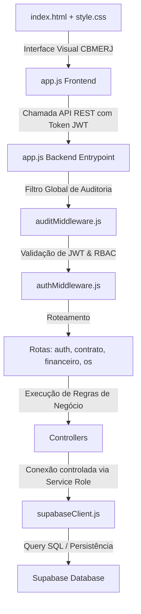

# Guia de Relações e Arquitetura do Projeto (Para Agentes de IA)

Olá, Agente! Este documento foi projetado especificamente para que você entenda de forma instantânea, lógica e sem fricção a arquitetura, o fluxo de dados e a divisão de responsabilidades deste repositório.

---

## 🗺️ Fluxo de Dados Global (Arquitetura)

O sistema segue um fluxo linear e limpo baseado no padrão **Client-Server-BaaS**:

---

## 📂 Dicionário de Arquivos e Pastas

### 📂 `src/` (Diretório Raiz do Código Fonte)

*   `📜 app.js`: Ponto de partida do servidor Express. Ele é o orquestrador que importa e acopla todos os middlewares, define a pasta estática pública do frontend, anexa todas as rotas com prefixo `/api` e escuta a porta de rede.

### 📂 `src/config/` (Configurações Centrais)
*   `📜 supabaseClient.js`: Estabelece a conexão com a API REST do Supabase. Utiliza a chave `SUPABASE_SERVICE_ROLE_KEY` no backend. **Atenção:** Como o backend executa validações manuais rigorosas de regras de negócios que as políticas PostgreSQL RLS normais não capturam com facilidade (como tetos matemáticos parciais), as chamadas do backend utilizam bypass seguro controlado por essa chave.

### 📂 `src/middlewares/` (Filtros de Segurança e Auditoria)
*   `📜 authMiddleware.js`: Intercepta todas as requisições privadas da API. Ele lê o cabeçalho `Authorization: Bearer <token>` e valida se a sessão é válida descriptografando o **JWT** com o `JWT_SECRET`. Além disso, gerencia o controle de acessos baseado em papéis (**RBAC**) para bloquear usuários com perfis insuficientes antes que a requisição chegue ao controlador (como a restrição total de escrita para a role **CONSULTA**).
    > [!NOTE]
    > **Mock Bypass para Testes:** Este middleware pode interceptar tokens que começam com `mock-` (ex: `mock-admin`, `mock-fiscal`) e injetar um usuário simulado com a role respectiva.
*   `📜 auditMiddleware.js`: Registra de forma nativa e padronizada todas as operações que causam efeitos no sistema. Exibe no console o timestamp da operação, o ID do usuário executor, o seu papel (Role), o método HTTP, a URL exata acessada e o tempo de processamento.

### 📂 `src/routes/` (Mapeador de Endpoints)
*   `📜 authRoutes.js`: Rotas para login, cadastro (exclusivo para Admin) e gestão de usuários (CRUD), além de verificação de sessão (`GET /api/auth/me`).
*   `📜 contratoRoutes.js`: Define os caminhos REST para Empresas, Aeronaves, Contratos Mãe e Termos Aditivos (Adesão). Aplica permissões onde apenas `ADMIN` pode alterar empresas/aeronaves ou realizar exclusões de contratos, e `FISCAL_CONTRATO` pode apenas cadastrar novos contratos ou aditivos.
*   `📜 osRoutes.js`: Define as rotas operacionais da OSE/RMS, itens de reparos e materiais. Permite escrita geral (inclusive para `OPERADOR_MANUTENCAO`), e inclui a rota sintética de alertas logísticos `/alertas-core-return`.
*   `📜 financeiroRoutes.js`: Mapeia as rotas de Notas Fiscais e o endpoint especial de faturamento em lote `/faturar-itens`.

### 📂 `src/controllers/` (Cérebro do Sistema - Regras de Negócio)
*   `📜 authController.js`: Lida com o módulo próprio de autenticação. Criptografa senhas com `bcryptjs`, gera os tokens `JWT` e gerencia a criação, edição (senha ou perfis por admin) e deleção dos usuários da tabela `users`.
*   `📜 contratoController.js`: Executa a inserção e listagem de contratos. Garante que a data de início do contrato não seja posterior à data de término.
*   `📜 osController.js`: Gerencia a criação de OSs e seus itens. Valida se a `data_solicitacao` está contida na vigência do Contrato Mãe vinculado. Consolida também os alertas de Core Return.
*   `📜 financeiroController.js`: Centraliza a integridade financeira. Contém as travas matemáticas mais importantes do sistema (veja abaixo).

### 📂 `src/public/` (Frontend SPA)
*   `📜 index.html`: Único arquivo HTML da aplicação. Contém a interface do login, do sidebar de abas, grids de cards e os modais de cadastro rápido. Usa SVGs inline para leveza de renderização.
*   `📜 style.css`: Folha de estilo que define a identidade visual do CBMERJ. Aplica o vermelho primário `#B30000` em destaques, o azul escuro `#1E2229` no sidebar e animações pulsantes nos alertas críticos. 100% Responsivo para telas desktop, tablets e mobile (com menu lateral retrátil em telas pequenas).
*   `📜 app.js`: Gerencia o fluxo visual da Single Page Application (SPA). Ele alterna a visualização das abas, faz requisições assíncronas de busca e inserção de dados na API backend, controla os modais e reage a erros exibindo um Toast flutuante.

---

## 🎯 Onde Localizar Cada Regra de Negócio Exigida

Se você for instruído a depurar ou alterar alguma regra de negócio, vá direto ao ponto:

### 1. Travas Financeiras de Notas Fiscais
*   **Onde fica:** [src/controllers/financeiroController.js](file:///Users/rogercandez/Documents/Gestão%20GOA/src/controllers/financeiroController.js) (nas funções `criarNotaFiscal` e `atualizarNotaFiscal`).
*   **O que faz:**
    *   Se a NF está associada a um **Termo Aditivo (Adesão)**: soma todas as NFs com status `PAGO` para aquela adesão e valida se $\sum \text{NFs Pagas} + \text{Nova NF} \le \text{valor\_aditivado}$.
    *   Se a NF está associada diretamente ao **Contrato original**: valida se $\sum \text{NFs Pagas} + \text{Nova NF} \le \text{valor\_total}$.
    *   Se violar, bloqueia a transação e retorna erro `400`.

### 2. Validação Estrita de Vigência (Datas)
*   **Onde fica:**
    *   **Para OS:** [src/controllers/osController.js](file:///Users/rogercandez/Documents/Gestão%20GOA/src/controllers/osController.js) (na função `criarOrdemServico`). Garante que a data de solicitação esteja entre a data de início e fim calculada do contrato.
    *   **Para NFs:** [src/controllers/financeiroController.js](file:///Users/rogercandez/Documents/Gestão%20GOA/src/controllers/financeiroController.js) (nas funções `criarNotaFiscal` e `atualizarNotaFiscal`). Garante que a emissão da nota esteja dentro da vigência do contrato mãe ou termo aditivo.

### 3. Logística Reversa (Core Return)
*   **Onde fica:** [src/controllers/osController.js](file:///Users/rogercandez/Documents/Gestão%20GOA/src/controllers/osController.js) (na função `obterAlertasCoreReturn`).
*   **O que faz:** Realiza um join sintético coletando todas as linhas de `os_servico_reparo` e `os_material_aquisicao` onde `core_retornado = false` e `deleted_at IS NULL`. Isso abastece o centro de alertas amarelo do Dashboard.

### 4. Faturamento Fracionado / Parcial
*   **Onde fica:** [src/controllers/financeiroController.js](file:///Users/rogercandez/Documents/Gestão%20GOA/src/controllers/financeiroController.js) (na função `faturarItensParcial`).
*   **O que faz:** Recebe arrays de IDs de reparo/material e uma `id_nota_fiscal` existente. Faz o update em massa ligando os itens à NF e permitindo que o faturamento de uma OS ocorra em parcelas.

### 5. Soft Delete
*   **Onde fica:** Em todos os controladores do backend (`src/controllers/`).
*   **O que faz:** As funções de remoção (ex: `deletarContratoLogico`, `deletarOrdemServicoLogico`) disparam comandos `.update({ deleted_at: new Date().toISOString() })` em vez de `.delete()`. Todas as listagens filtram explicitamente com `.is('deleted_at', null)`.
